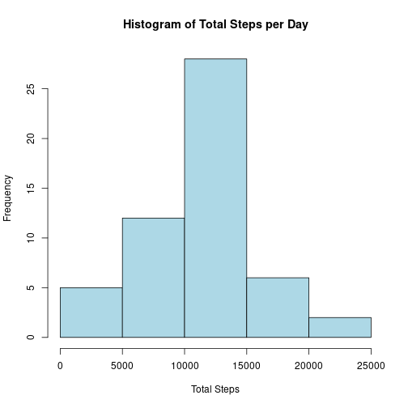
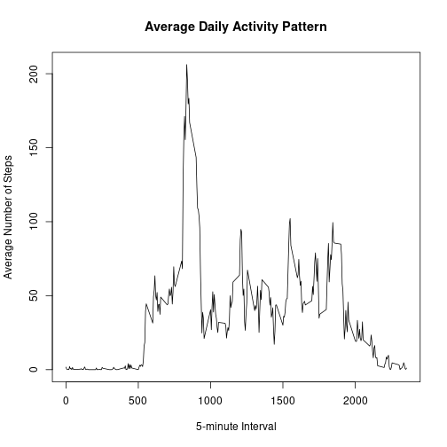
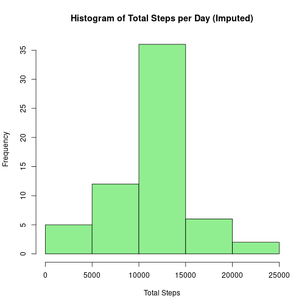
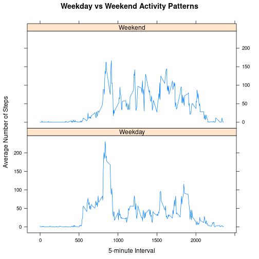

```r
knitr::opts_chunk$set(echo = TRUE)
data <- read.csv("activity.csv")
data$date <- as.Date(data$date)
total_steps <- aggregate(steps ~ date, data, sum, na.rm = TRUE)
hist(total_steps$steps,
main = "Histogram of Total Steps per Day",
xlab = "Total Steps",
col = "lightblue")
```



```r
mean(total_steps$steps)
```

```
## [1] 10766.19
```

```r
median(total_steps$steps)
```

```
## [1] 10765
```

```r
avg_interval <- aggregate(steps ~ interval, data, mean, na.rm = TRUE)

plot(avg_interval$interval,
avg_interval$steps,
type = "l",
xlab = "5-minute Interval",
ylab = "Average Number of Steps",
main = "Average Daily Activity Pattern")
```



```r
avg_interval[which.max(avg_interval$steps), ]
```

```
##     interval    steps
## 104      835 206.1698
```

```r
sum(is.na(data$steps))
```

```
## [1] 2304
```

```r
imputed_data <- data

interval_means <- aggregate(steps ~ interval, data, mean, na.rm = TRUE)

na_index <- is.na(imputed_data$steps)

imputed_data$steps[na_index] <-
interval_means$steps[
match(imputed_data$interval[na_index],
interval_means$interval)
]
imputed_total_steps <- aggregate(steps ~ date, imputed_data, sum)

hist(imputed_total_steps$steps,
main = "Histogram of Total Steps per Day (Imputed)",
xlab = "Total Steps",
col = "lightgreen")
```



```r
mean(imputed_total_steps$steps)
```

```
## [1] 10766.19
```

```r
median(imputed_total_steps$steps)
```

```
## [1] 10766.19
```

```r
imputed_data$day_type <- ifelse(
weekdays(imputed_data$date) %in% c("Saturday", "Sunday"),
"Weekend",
"Weekday"
)

imputed_data$day_type <- factor(imputed_data$day_type)

interval_daytype <- aggregate(
steps ~ interval + day_type,
imputed_data,
mean
)
library(lattice)

xyplot(steps ~ interval | day_type,
data = interval_daytype,
type = "l",
layout = c(1, 2),
xlab = "5-minute Interval",
ylab = "Average Number of Steps",
main = "Weekday vs Weekend Activity Patterns")
```


